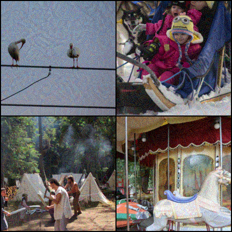

!!! danger
    This section of the documentation is still under construction. Please check back later for updates.

**Adversarial examples** are tricky inputs designed to confuse machine learning models.

In vision tasks like image classification, these examples are created by slightly altering an original image. The changes are so small that humans can't really notice them, yet they can cause significant shifts in the model's prediction.

<figure markdown="span">
    { width=240 }
    <figcaption>Benign Image</figcaption>
</figure>
<figure markdown="span">
    { width=240 }
    <figcaption markdown>[MIFGSM](../attacks/mifgsm.md) :octicons-arrow-right-24: ResNet50</figcaption>
</figure>
<figure markdown="span">
    { width=240 }
    <figcaption markdown>[TGR](../attacks/tgr.md) :octicons-arrow-right-24: ViT-B/16</figcaption>
</figure>

torchattack is a library for PyTorch that offers a variety of state-of-the-art attacks to create these adversarial examples. **It focuses on transferable black-box attacks on image classification models.** The attacks are implemented over a thin abstraction layer (`torchattack._attack.Attack`), with minimal changes to the original research paper, along with comprehensive type hints and comments, to make it easy for researchers like you and me to use and understand.

The library also provides tools to load pretrained models, set up attacks, and run tests.

To get started, follow the links below:

- [Loading pretrained models and important attributes](./attack-model.md)
- [Creating and running attacks](./attack-creation.md)
- [Loading a dataset and running evaluations](./attack-evaluation.md)
- [A full example to evaluate transferability](./runner.md)

Or dive straight into [all available attacks](../attacks/index.md).
